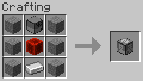
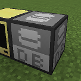

# CCDatabasePeripheralLite

A Minecraft mod to add a peripheral for [CC: Tweaked](https://tweaked.cc/) to manipulate databases using [SQLite JDBC Driver](https://github.com/xerial/sqlite-jdbc).

## Requirements

- Minecraft 1.20.1
- Minecraft Forge 47.3.0+
- CC: Tweaked 1.20.1-forge-1.112.0+

## Installation

Download a JAR file named `*-all.jar` from [Releases](https://github.com/Iunius118/cc-dbp-lite/releases) and place it in your `mods` folder.

## How to Get Started

1. Craft a Database Storage

   from 6 Stones, 1 Disk Drive, 1 Block of Redstone, and 1 Iron Ingot

   

2. Connect the Database Storage to a Computer

   

3. Call functions of the Database Storage from the computer and manipulate database

    See [mod_description.md](docs/mod_description.md) for more information about Database Storage functions

Sample code:

```Lua
-- Find peripheral
local db = peripheral.find("dbstorage")

if not db then
  print("Database Storage was not found")
  return
end

-- Connect to database
local stmt = db.createStatement()

print("Connected to database, storage ID " .. db.getID())

-- Execute update
stmt.execute("DROP TABLE IF EXISTS player")
stmt.execute("CREATE TABLE player (id INTEGER PRIMARY KEY, name TEXT)")
stmt.execute("INSERT INTO player VALUES(1, 'Steve')")
stmt.execute("INSERT INTO player VALUES(2, 'Alex')")
stmt.execute("INSERT INTO player VALUES(3, 'Noor')")

-- Execute query
stmt.execute("SELECT * FROM player")

-- Get result set
local rs = stmt.getResultSet()

-- Print result
local result = {colors.orange, {"id", "name"}, colors.white}

while rs.next() do
  local id = rs.getString("id")  -- Get id as string
  local name = rs.getString("name")
  table.insert(result, {id, name})
end

textutils.tabulate(table.unpack(result))

-- Disconnect from database
rs.close()
stmt.close()
```
